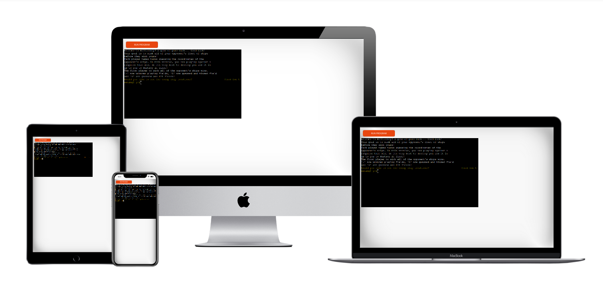
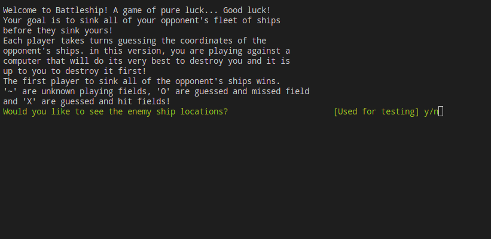
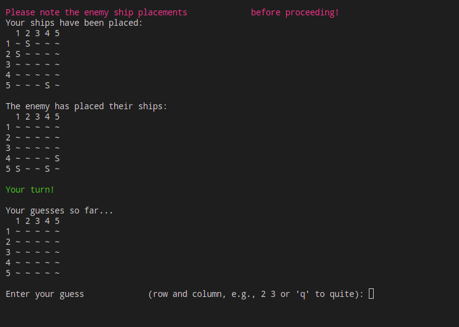
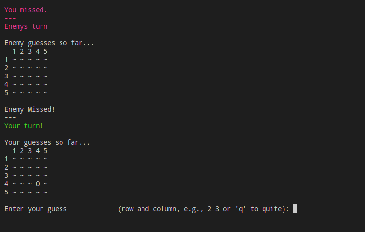
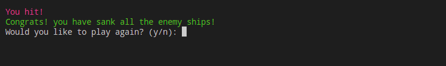
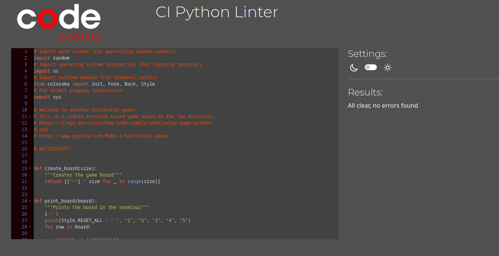

# Battleship!

## Table of Contents
1. [How to Play](#how-to-play)
2. [Features](#features)
   - [Existing Features](#existing-features)
   - [Future Features](#future-features)
3. [Data Model](#data-model)
4. [Testing](#testing)
   - [Bugs](#bugs)
     - [Solved Bugs](#solved-bugs)
     - [Remaining Bugs](#remaining-bugs)
   - [Validator](#validator)
5. [Development](#development)
6. [Credits](#credits)

## How to Play
Battleship is a classic strategy game where you try to sink your opponent's fleet of ships before they sink yours. Each player takes turns guessing the coordinates of the opponent's ships. The first player to sink all the opponent's ships wins.
In this version, you are playing against a computer that will do it's very best to destroy you and it is up to you to destroy it first!

To play the game:
1. Start the game by running the [Heroku](https://terminal-based-battleship-ad2683f69f33.herokuapp.com/) app.
2. Choose whether you wish to see the enemy ship placement by entering **y** for yes or **n** for no.
3. If you wish, you may exit the game at any time by clicking **q**
4. Enter the coordinates for your guesses when prompted.
5. The game will indicate whether you have hit or missed a ship.
6. Continue guessing until all ships are sunk!

## Features

### Existing Features
- **Interactive Command Line Interface:** The game is played through the terminal; giving a welcome message to the player, telling them about the game, how it is played, what the different symbols on the board are and asking if they wish to see enemy ship placement for testing of the game.
 
- **Random Ship Placement:** Once the player makes their initial choice, the boards are generated. Each board is randomly generated, one for the player and one for the enemy. (Here, the player chose to see the enemy ship placement).
 
- **Turn-based Gameplay:** The player is then prompted to make a guess and fire upon the enemy ships. The player can guess any two numbers between 1 and 5 to target. These coordinates are marked on the top and left side of each board.
 
- **Victory Message:** Once there is a winner, be it the player or the enemy, there is a win or lose screen. (Here the player won) This is then followed by a question if the player would like to continue playing with another game or quite playing, (y/n).
 
- **Colorama:** Throughout the player will experience a bit more than the normal black and white terminal text with colors imported with colorama. This adds some variation to text and not only adds to the interesting factor but also increases contrast of important messages and clarifies positive or negative results.

### Future Features
- **Multiplayer Mode:** Allowing two players to play remotely.
- **Enhanced AI:** Improving the computer's strategy for choosing guesses, such as implementing known battlefield scanning patterns or even a basic neural network.
- **Graphical Interface:** Adding a GUI for a more engaging experience.
- **Different size ships** Adding different size ships to allow variation and add a bit more strategy to the game.
- **Player ship placement** Allow the player to decide their ship placement and orientation (assuming different size ships).
- **Restart game from play screen** Allow the player to restart the game, for example by pressing **r** instead of giving **a**

## Data Model
The data model for Battleship includes:
- **Grids:** A 10x10 grid representing the game board; "~" representing unknown waters, "S" representing ships, "X" representing hit marks, "O" representing guessed and missed marks.
- **Guesses:** Each time the player or computer guesses, the grid is updated to show this change and its result.

## Testing

False input testing for all game inputs:
- A letter (not the one requested) "a"
- Multiple letters "abc"
- A single number "1"
- Multiple numbers "123"
- An empty ENTER with no input
- Only spaces 
- Special characters ? ! @ etc

### Bugs

#### Solved Bugs
- **Bug:** Game crash when inputting invalid coordinates.
  - **Solution:** Added input validation to handle incorrect inputs.
- **Bug:** Shortening of long lines caused breakage.
  - **Solution:** Added correct syntax "\" to lines to fix the problem.
- **Bug:** The input of 0 0 was possible due to no lower limit.
  - **Solution:** Added check that input is greater than 0.

#### Remaining Bugs
- **Bug:** Player and computer are able to guess a single tile more than once, 
 wasting a turn.  
  - **Status:** This could be solved with a tracker function, preventing duplicate inputs for a single game.
- **Bug:** Syntax warning regarding the correct use of == or "is".
  - **Status:** The given CI Python linter suggested the correct use is replacing == with "is" and in the end this was the one the final submission is based on. However on compilation, there are complaints that the "is" should be reverted to ==. There seems to be a confusion in which syntax is better used, with each having a different opinion on correct syntax. Game function is unaffected.

### Validator
The code has been validated using the following tools:
- **PEP8:** Ensuring Python code style guidelines are met.
  

- **Heroku Validator:** Ensuring the application is correctly deployed and running on Heroku.
  - The game runs, fully deployed without error on the [Heroku server.](https://terminal-based-battleship-ad2683f69f33.herokuapp.com/)

## Deployment
The game was deployed using the Heroku app hosting service:
- Steps for deployment
  - Fork or clone the [repository](https://github.com/TheBlep/Terminal-based-battleship)
  - Create a new Heroku app
  - Set the build packs (under settings) to 'Python' and 'Node.js'. Where Python is **above** Node.js
  - Link the Heroku app to the repository
  - Click on **Deploy**
- Active deployment
  - Another option is to use the active Heroku deployment [here](https://terminal-based-battleship-ad2683f69f33.herokuapp.com/)
- Local deployment
  - Fork or clone the [repository](https://github.com/TheBlep/Terminal-based-battleship)
  - Open the file in your favorite IDE
  - Run the run.py in a python terminal
  - Enjoy!

## Credits
- **Developer:** TheBlep
- **Inspiration:** The classic Battleship game
- **Resources:** Python documentation, Stack-overflow, Heroku deployment guides, W3C, and two tutorials:
 https://llego.dev/posts/how-code-simple-battleship-game-python/ and \
 https://www.pyshine.com/Make-a-battleship-game/
