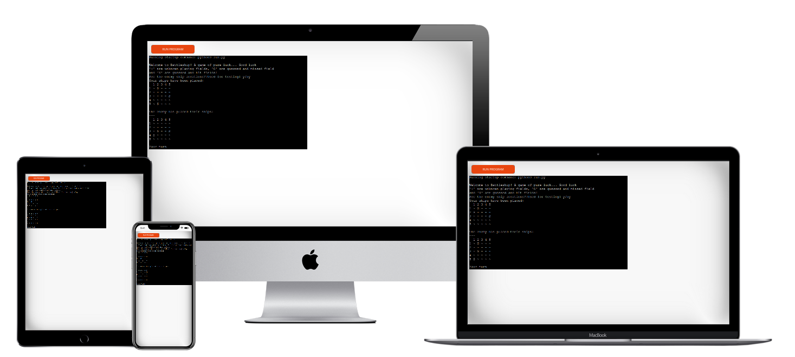
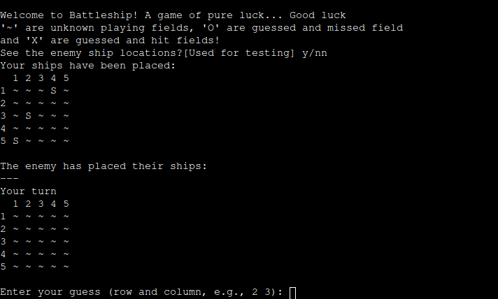
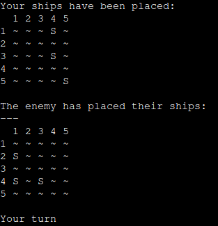
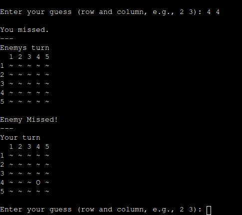
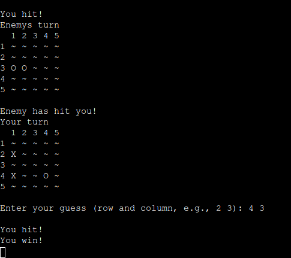

# Battleship

## Table of Contents
1. [How to Play](#how-to-play)
2. [Features](#features)
   - [Existing Features](#existing-features)
   - [Future Features](#future-features)
3. [Data Model](#data-model)
4. [Testing](#testing)
   - [Bugs](#bugs)
     - [Solved Bugs](#solved-bugs)
     - [Remaining Bugs](#remaining-bugs)
   - [Validator](#validator)
5. [Development](#development)
6. [Credits](#credits)

## How to Play
Battleship is a classic strategy game where you try to sink your opponent's fleet of ships before they sink yours. Each player takes turns guessing the coordinates of the opponent's ships. The first player to sink all of the opponent's ships wins.
In this version, you are playing against a computer that will do its very best to destroy you and it is up to you to destroy it first!

To play the game:
1. Start the game by running the [Heroku](https://terminal-based-battleship-ad2683f69f33.herokuapp.com/) app.
2. Choose wether you wish to see the enemy ship placement by entering **y** for yes or **n** for no.
2. Enter the coordinates for your guesses when prompted.
3. The game will indicate whether you have hit or missed a ship.
4. Continue guessing until all ships are sunk!

## Features

### Existing Features
- **Interactive Command Line Interface:** The game is played through the terminal.
  
- **Random Ship Placement:** Ships are placed randomly on the board at the start of each game.

  
- **Turn-based Gameplay:** Players take turns to guess the coordinates of enemy ships.

  
- **Victory Message:** The game announces the winner when all ships of one player are sunk.

  

### Future Features
- **Multiplayer Mode:** Allowing two players to play remotely.
- **Enhanced AI:** Improving the computer's strategy for choosing guesses, such as implementing known battlefield scanning patterns or even a basic neural network.
- **Graphical Interface:** Adding a GUI for a more engaging experience.
- **Different size ships** Adding different size ships to allow variation and add a bit more stratagy to the game.
- **Player ship placement** Allow the player to decide their ship placement and orentation (assuming different size ships).

## Data Model
The data model for Battleship includes:
- **Grids:** A 10x10 grid representing the game board; "~" representing unknown waters, "S" representing ships, "X" representing hit marks, "O" representing guessed and missed marks.
- **Guesses:** Each time the player or computer guesses, the grid is updated ot show this change and its result.
## Testing

### Bugs

#### Solved Bugs
- **Bug:** Game crash when inputting invalid coordinates.
    - **Solution:** Added input validation to handle incorrect inputs.
- **Bug:** shortening of long lines caused breakage.
    - **Solution:** Added correct syntax "\" to lines to fix the problem.

#### Remaining Bugs
- **Bug:** Player and computer are able to guess a single tile more than once, waisting a turn.  
    - **Status:** This could be solved with a tracker function, preventing duplicate inputs for a single game.

### Validator
The code has been validated using the following tools:
- **PEP8:** Ensuring Python code style guidelines are met.
- **Heroku Validator:** Ensuring the application is correctly deployed and running on Heroku.

## Deployment
The game was deployed using the Heroku app hosting service:
- Steps for deployment
    - Fork or clone the repository
    - Create a new Heroku app
    - Set the buildpacks (under settings) to 'Python' and 'NodeJS'. Where Python is **above** NodeJS
    - Link the Heroku app to the repository
    - Click on **Deploy**

## Credits
- **Developer:** TheBlep
- **Inspiration:** The classic Battleship game
- **Resources:** Python documentation, Heroku deployment guides, W3C, and two tutorials:
    https://llego.dev/posts/how-code-simple-battleship-game-python/ and \
    https://www.pyshine.com/Make-a-battleship-game/